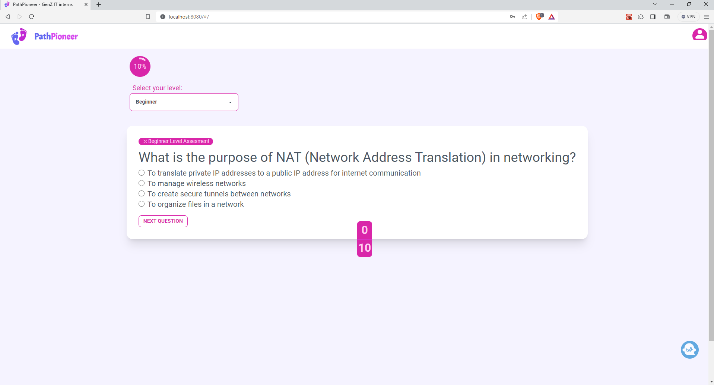

# PathPioneer Learning App 📚



Welcome to the PathPioneer Learning App repository!

## Overview ℹ️

This repository contains the source code for the PathPioneer Learning App, an educational application designed to help users learn and practice various skills. 🎓

## Table of Contents 📋

- [Features](#features) ✨
- [Installation](#installation) 🛠️
- [Usage](#usage) 🖥️
- [Contributing](#contributing) 🤝
- [License](#license) 📜

## Features 🌟

- **Skills Assessment:** Ability to assess and track user progress. - (Main Feature)
- **Learning Modules:** Engaging modules covering a wide range of subjects.
- **User Authentication:** Secure login and authentication functionalities.
- **Interactive Learning:** Reward and punishment system for interactive learning.
### New Features 😋

- **Notifications:** Pop up Alert with emojies to show a succesful action or an error.

# Live Project 🚀
https://pioneer.tangikuu.tech/

# Technologies Used 🛠️

- ⚛️ **React**
- 🔥 **Firebase**
- 🌐 **Tailwind CSS**
- 🔶 **React Icons**

## Installation 🔧

1. Clone the repository:

   ```bash
   git clone https://github.com/majortank/pathpioneer.git
   ```

2. Install dependencies:

   ```bash
   cd pathpioneer
   npm install
   ```

3. Set up environment variables.

4. Start the application:

   ```bash
   npm start
   ```

## Code Break Down 💻

For detailed breakdown on how to use the code in this repo, refer to the [Wiki](https://github.com/majortank/pathpioneer/wiki).

## Contributing 🤝

We welcome contributions from the community! If you'd like to contribute to this project, please follow these steps:

1. Fork the repository.
2. Create a new branch (`git checkout -b feature/your-feature`).
3. Make your changes.
4. Commit your changes (`git commit -am 'Add some feature'`).
5. Push to the branch (`git push origin feature/your-feature`).
6. Create a new Pull Request.

## License 📜

This project is licensed under the MIT License - see the [LICENSE](LICENSE.md) file for details.
